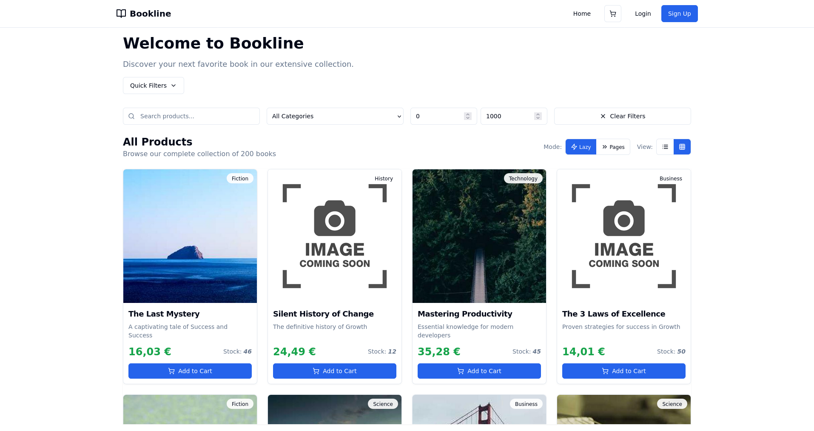

# Bookline Ecommerce 1.0.1

An opinionated starter for an e-commerce storefront built with Next.js, React and Tailwind CSS — focused on DX (TypeScript, Vitest, Playwright) and modern UI primitives.

## Screenshots



## Features

- Next.js (app/pages compatible)
- TypeScript-ready
- Tailwind CSS for utility-first styling
- Unit/component testing with Vitest + Testing Library
- End-to-end tests with Playwright
- Opinionated dev scripts for dev/build/test and CI

## Installation

Clone and install dependencies (pnpm recommended):

```zsh
pnpm install
```

Start the dev server:

```zsh
pnpm dev
```

Build for production:

```zsh
pnpm build && pnpm start
```

## Useful pnpm scripts

The `package.json` ships convenient scripts:

- `pnpm dev` — start Next.js in development
- `pnpm build` — create an optimized production build
- `pnpm start` — run the production server

Run the script that suits your workflow. Replace `pnpm` with `npm` or `yarn` if you prefer.

## Running Tests

To run tests, run the following command

```bash
- `pnpm test` — run unit tests (Vitest)
- `pnpm test:watch` — interactive test watch mode
- `pnpm test:ci` — run tests with coverage for CI
- `pnpm e2e` — run Playwright E2E tests
- `pnpm e2e:install-browsers` — install Playwright browsers
```

## Appendix

@Author pachibadilla@gmail.com
